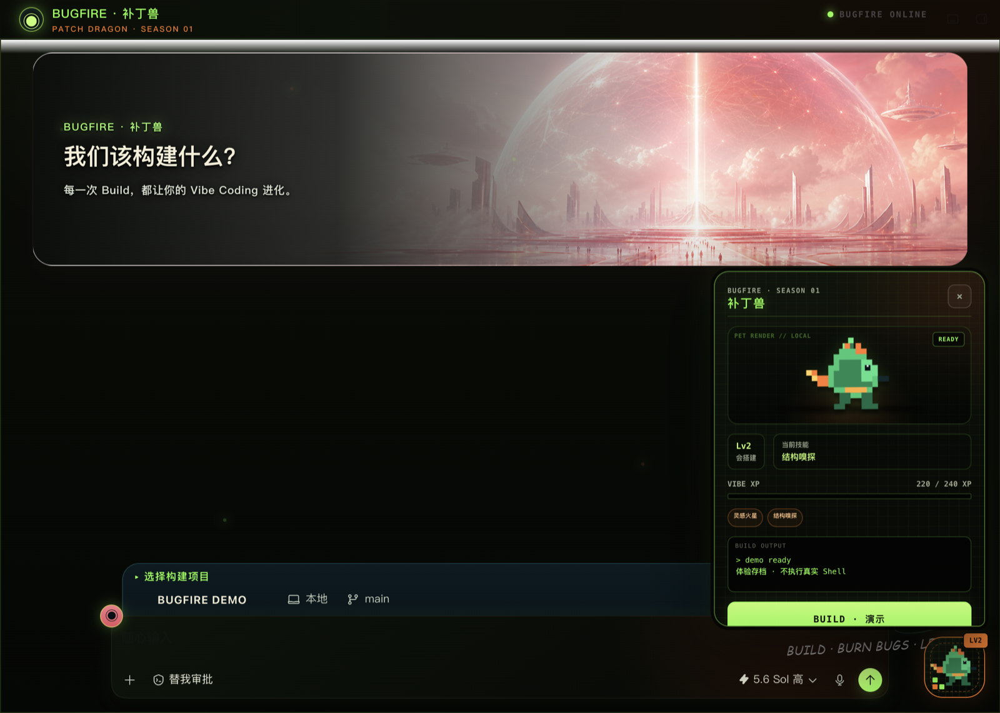
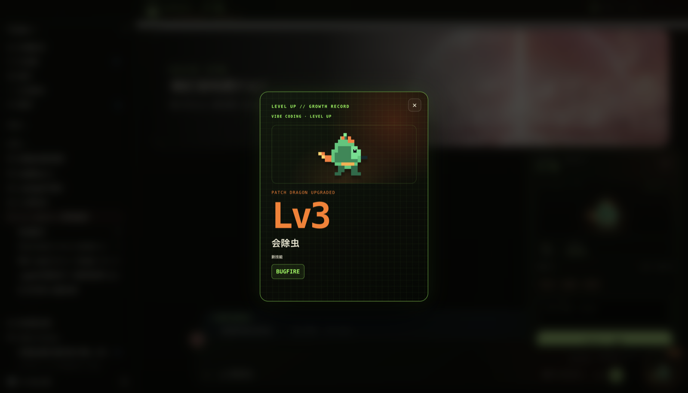
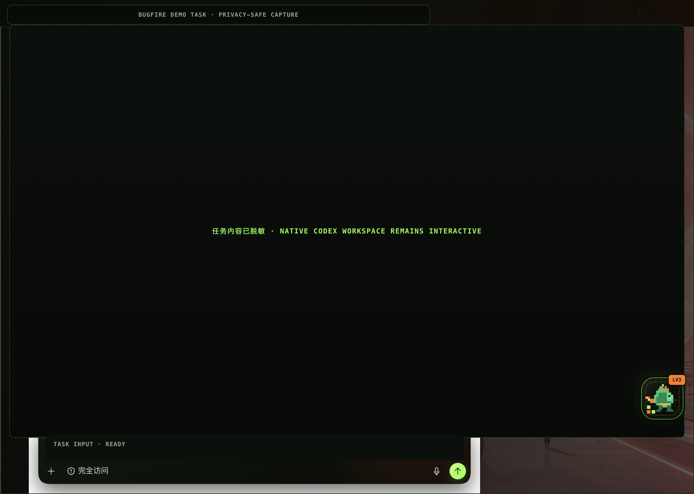
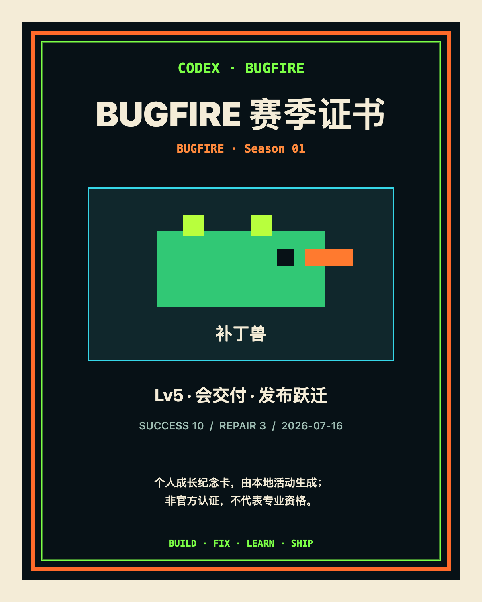

# BUGFIRE「补丁兽」中文使用说明

> 适用版本：`1.3.0-bugfire.1`
> 最后更新：2026-08-31
> 平台：macOS + 官方 Codex Desktop

BUGFIRE 是 Codex Desktop 的本地像素桌宠扩展。它提供模拟 Build、Bug 喷火、XP、技能、成长卡和赛季纪念证书，不执行真实项目命令，也不代表编程能力认证。

## 1. 安装前需要准备什么？

- macOS
- 官方 Codex Desktop 已安装，并至少启动过一次
- 当前用户的 `~/.codex/config.toml` 已由 Codex 创建
- 首次启用允许关闭并重开 Codex 一次

不需要单独安装 Node.js。脚本会发现官方 Codex 应用，验证签名、Team ID、架构和内置 Node.js，再继续安装。

## 2. 如何安装？

### 方法 A：双击安装

1. 下载或克隆项目到本机。
2. 打开 `macos` 文件夹。
3. 双击 `Install Codex Dream Skin.command`。
4. 首次应用时，在系统对话框中选择“重启并应用”。
5. Codex 重新打开后，在右下角寻找绿色像素补丁龙。

安装器会把独立运行副本放到 `~/.codex/codex-dream-skin-studio`，不会修改官方 `.app` 或 `app.asar`。

### 方法 B：终端安装

在仓库根目录执行：

```bash
cd macos
./tests/run-tests.sh
./scripts/install-dream-skin-macos.sh --no-launch
~/.codex/codex-dream-skin-studio/scripts/start-dream-skin-macos.sh --prompt-restart
```

`--no-launch` 只完成安装，最后一条命令再显式启动。若 Codex 已在运行且还没有经过验证的 CDP 端点，脚本会请求一次重启确认。

## 3. 安装后有哪些入口？

默认会在桌面创建四个启动器：

| 启动器 | 用途 |
| --- | --- |
| `Codex Dream Skin.command` | 启动或重新应用皮肤 |
| `Codex Dream Skin - Customize.command` | 更换背景图和主题颜色 |
| `Codex Dream Skin - Verify.command` | 验证并保存运行截图 |
| `Codex Dream Skin - Restore.command` | 移除注入并恢复原外观 |

本地文件位置：

| 内容 | 路径 |
| --- | --- |
| 已安装引擎 | `~/.codex/codex-dream-skin-studio` |
| 状态与日志 | `~/Library/Application Support/CodexDreamSkinStudio` |
| BUGFIRE 进度 | `~/Library/Application Support/CodexDreamSkinStudio/bugfire-progress.json` |
| 主题备份 | Application Support 目录中的 `theme-backup.json` |

## 4. 第一次怎么玩？

首次载入的是明确标注的体验存档：`Lv2 · 220/240 XP`。

1. 点击 Codex 右下角约 72 px 的宠物浮巢。
2. 宠物舱展开后，点击 `BUILD · 演示`。
3. 首次 Build 会失败并生成一只 Bug；失败不奖励 XP。
4. 按钮变为“已修复，重新 Build”，再次点击。
5. 补丁兽进入喷火状态并消灭 Bug。
6. Build 成功，获得 35 XP，从 Lv2 升至 Lv3，并弹出成长卡。

这套流程只在本地状态机中运行。它不会调用 `npm`、`pnpm`、`make`、`xcodebuild` 或任何项目命令。

<p align="center">
  
  
</p>

## 5. 有哪些操作方式？

| 操作 | 结果 |
| --- | --- |
| 点击宠物浮巢 | 展开或收起宠物舱 |
| `Tab` 聚焦 + `Enter` / `Space` | 键盘触发当前按钮 |
| `Esc` | 收起宠物舱或关闭成长卡/证书 |
| `BUILD · 演示` | 开始一次模拟 Build |
| “已修复，重新 Build” | 结算一次修复成功 |
| “重置体验” | 清空活动与卡片，回到 Lv1 / 0 XP |
| “证书” | 已解锁后查看并导出 PNG |

进入普通任务页时，展开的宠物舱会自动收起，避免遮挡输入框。窄窗口会自动压缩布局；系统开启“减少动态效果”后，动画强度会降低。



## 6. 等级和技能如何计算？

| 等级 | XP | Vibe 阶段 | 解锁技能 |
| --- | ---: | --- | --- |
| Lv1 | 0–99 | 会描述 | 灵感火星 |
| Lv2 | 100–239 | 会搭建 | 结构嗅探 |
| Lv3 | 240–449 | 会除虫 | BUGFIRE |
| Lv4 | 450–749 | 会验收 | 测试结界 |
| Lv5 | 750+ | 会交付 | 发布跃迁 |

失败只增加失败记录，不增加 XP。一次已结算的修复事件不会重复奖励；达到新等级时会生成对应的 4:5 成长卡。

## 7. 什么时候生成证书？

赛季证书需要同时满足以下条件：

- 达到 Lv5（750 XP 或以上）
- 累计至少 10 次成功 Build
- 累计至少 3 次修复重建成功

解锁后，从宠物舱点击“证书”，再导出 PNG。证书是本地生成的成长纪念图，固定包含以下声明：

> 个人成长纪念卡，由本地活动生成；非官方认证，不代表专业资格。



## 8. 如何验证运行状态？

### 环境与实时会话检查

```bash
~/.codex/codex-dream-skin-studio/scripts/doctor-macos.sh --require-live
```

成功时会输出 JSON，并包含 `"pass": true`、版本、官方签名状态、实时注入状态和回环端口。

### 刷新后验证并截图

```bash
~/.codex/codex-dream-skin-studio/scripts/verify-dream-skin-macos.sh \
  --reload \
  --screenshot "$HOME/Desktop/BUGFIRE Verification.png"
```

此检查会刷新 renderer，确认皮肤和宠物能够重新注入，并验证侧栏、主区、输入框和宠物交互标记。

## 9. 如何暂停、恢复或重新启用？

### 暂停：保留 Codex 运行

```bash
~/.codex/codex-dream-skin-studio/scripts/pause-dream-skin-macos.sh
```

暂停会停止 injector 并移除当前页面里的皮肤 DOM/CSS，但不会关闭 Codex，也不会恢复安装前保存的基础主题设置。

### 完全恢复官方外观

```bash
~/.codex/codex-dream-skin-studio/scripts/restore-dream-skin-macos.sh \
  --restore-base-theme \
  --restart-codex
```

恢复会停止记录过且身份匹配的 injector、移除 DOM/监听器/样式、恢复备份的外观键，并正常重启 Codex。它不会改动官方签名。

### 重新启用

```bash
~/.codex/codex-dream-skin-studio/scripts/start-dream-skin-macos.sh --prompt-restart
```

如果经过验证的 CDP 已经存在，脚本可以热应用；否则会先请求重启确认。

## 10. 如何更换背景？

双击桌面的 `Codex Dream Skin - Customize.command`，或执行：

```bash
~/.codex/codex-dream-skin-studio/scripts/customize-theme-macos.sh
```

支持 macOS 可读取的 PNG、JPEG、HEIC、TIFF 和 WebP。建议使用宽度不小于 2000 px、左侧较安静的宽图，让首页标题和原生控件保持清晰。

## 11. 如何制作自己的宠物包？

可以。`Bugfire Pack v1` 是完全本地的声明式编译器，最少需要一张背景图、一张 `idle` 宠物图、包名、宠物名和素材权利声明；另外五种状态图可选，缺失时复用 `idle`。

```bash
cd macos
. ./scripts/common-macos.sh
discover_codex_app
require_macos_runtime

PACK="$HOME/Documents/my-bugfire-pack"
OUTPUT="$HOME/Documents/my-bugfire-pack-built"

"$NODE" ./scripts/bugfire-pack.mjs init "$PACK"
# 将图片放进 "$PACK/assets"，再编辑 bugfire-pack.json
"$NODE" ./scripts/bugfire-pack.mjs validate "$PACK"
"$NODE" ./scripts/bugfire-pack.mjs build "$PACK" "$OUTPUT"
./scripts/install-bugfire-pack-macos.sh --pack "$PACK" --no-apply
```

`init` 只创建目录、清单和 `assets/`，不会生成、下载或上传宠物图片。清单可配置：

- 背景、标题文案和九组主题色
- 宠物名称、赛季与六种状态图
- 单次修复成功奖励 1–100 XP
- 1–12 条互动台词
- 1–5 个任务；指标只允许 `repairedBuilds`、`successfulBuilds`、`failedBuilds`、`xp`、`level`
- 纪念证书标题和必填的素材权利声明

五级 XP 阈值和技能表保持固定。背景限 16 MiB / 8192 px 单边 / 32 Mi 像素；单张宠物图限 4 MiB / 4096 px 单边 / 8 Mi 像素，宠物图合计限 16 MiB。只接受 PNG/JPEG/WebP，拒绝动画、远程素材、路径穿越、符号链接、伪造格式和包内脚本/CSS。

`--no-apply` 只安装到主题库，不改变当前界面和进度。更换 `id` 或 `seasonId` 会归档当前活动存档并建立新的 Lv2 体验存档；不同宠物包的进度不会合并。完整素材约定、预览和分享规则见 [定制指南](CUSTOMIZATION.zh-CN.md)。

## 12. 进度保存了什么？

`bugfire-progress.json` 采用原子写入，文件权限为 `0600`。它只保存：

- 数据版本、宠物 ID、赛季 ID
- XP、失败次数、成功次数、修复成功次数
- 已解锁技能
- 成长卡与赛季纪念卡记录
- 已结算事件标识与更新时间

它不保存任务正文、提示词、对话、源码、文件内容、API Key、Base URL 或 Shell 输出。

## 13. 常见故障怎么处理？

### 看不到宠物浮巢

1. 确认 Codex 已经打开。
2. 运行 `doctor-macos.sh --require-live`。
3. 再运行一次 `start-dream-skin-macos.sh --prompt-restart`。
4. 若 Codex 刚升级，运行带 `--reload` 的验证命令并查看输出。

### 文字或输入框对比度不正常

先运行 `verify-dream-skin-macos.sh --reload` 让最新版 CSS 重新注入。如果仍然存在问题，请截图并注明：Codex 版本、浅色/深色外观、页面类型（首页或任务页）和窗口尺寸。

### 启动提示端口未验证

不要手动把 CDP 暴露到局域网。先关闭 Codex，再通过桌面启动器重新打开；脚本只接受归属于 Codex 的本机回环端点。

### 进度文件损坏

状态层会拒绝超大或不符合结构的存档，并隔离损坏文件。可以在宠物舱点击“重置体验”建立新的 Lv1 存档；不要把不受信任的 JSON 放入状态目录。

### `pack validate` 失败

先看错误指向的字段或素材：确认 `pet.art.idle` 存在、扩展名与真实内容一致、图片未超限、路径位于包内 `assets/`，且 `rights.declaration` 已填写。不要通过关闭校验来安装包。

### 切换宠物包后回到 Lv2

这是身份隔离规则，不是存档丢失。新的 `id` 或 `seasonId` 会生成独立体验存档，旧记录保留在进度文件旁的 `.previous...` 归档中。

## 14. 安全提醒

- CDP 仅绑定 `127.0.0.1`，不要改成 `0.0.0.0` 或公网地址。
- CDP 权限较高，主题运行期间不要执行来路不明的本机程序。
- 不要把 `~/Library/Application Support/CodexDreamSkinStudio` 中的状态和日志直接上传到公开 Issue；先检查是否包含本机路径等环境信息。
- BUGFIRE 不是 OpenAI 官方产品，也不是职业资格、培训证书或能力评估工具。

## 15. 如何反馈问题？

提交问题时建议附上：

- BUGFIRE 版本与 Codex Desktop 版本
- macOS 版本与芯片架构
- `doctor-macos.sh` / `verify-dream-skin-macos.sh` 的脱敏输出
- 不含私人任务内容的截图
- 可稳定复现的最短步骤

不要提交 API Key、任务正文、项目源码或未脱敏的完整 Application Support 目录。
