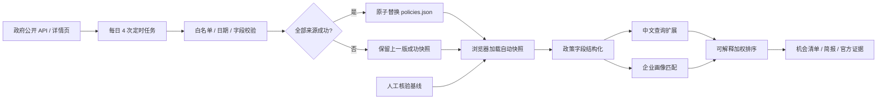

# 智策雷达技术架构

作者：siuser小伟

## 设计目标

智策雷达面向政策信息分散、更新频繁和企业适用性判断成本高的问题，提供“定时核验—抽取—匹配—解释—简报”的完整闭环。GitHub Pages 是定时快照消费者，不是访问时实时爬虫。

## 数据流

## 核心模块

### 1. 权威数据层

- 来源限制为政府官方网站或政府公报。
- 核心字段包括地区、发布机构、发布日期、截止日期、状态、行业、企业规模、诉求、支持方向和原文证据。
- 每条记录保留原文 URL，结论可回溯。
- 自动快照记录生成时间、上次成功时间和逐来源抓取/接纳数量。
- 任一自动来源失败时任务报错，且不改写上一版快照。
- 自动来源与人工基线在界面中使用不同标签，不混淆覆盖范围。

### 2. 查询理解层

本地引擎对中文查询做规范化、片段化和同义概念扩展。例如“AI 制造”会扩展到“人工智能、大模型、智能体、工业、新型工业化”等概念。

### 3. 画像匹配层

匹配分由五类信号组成：

- 查询与标题、标签、摘要和支持方向的相关度；
- 地区覆盖；
- 行业适配；
- 企业规模适配；
- 发展诉求与政策有效性。

输出不仅有分数，还保留“地区精准覆盖、行业匹配、当前有效”等解释标签。

### 4. 简报生成层

系统选取优先级最高的政策，结合企业画像生成行动建议，并附匹配依据和官方来源。演示版使用确定性生成，保证离线可运行；生产版可在服务端接入经过授权的大模型接口。

## 安全与隐私

- 企业画像默认只在浏览器内存中处理。
- 不保存 API 密钥、不采集账号密码、不上传企业材料。
- 外部链接使用 HTTPS，并以新窗口打开。
- 本地服务限制绑定到 `127.0.0.1`。
- 所有生成结论都保留“以官方最新通知为准”的边界声明。

## 当前边界

- 自动核验范围目前是东莞市工业和信息化局已配置的公开栏目，不是全网。
- GitHub Pages 只读取最近成功快照；“更新”频率由 Actions 定时计划和官方源可用性决定。
- 正文中无法严格确认的截止时间保留为空，不能由目录状态或常识猜测。
- 匹配分用于初筛，不构成资格、补贴金额或申报成功承诺。

## 后续扩展

1. 增加政策定时采集、正文哈希和版本差异检测。
2. 使用结构化抽取模型生成字段候选，再由规则与人工抽检复核。
3. 建立企业画像权限隔离、加密存储和删除机制。
4. 增加政策窗口提醒、材料清单和申报进度管理。
5. 通过离线评测集持续监控抽取准确率、召回率、引用正确率和更新时延。
